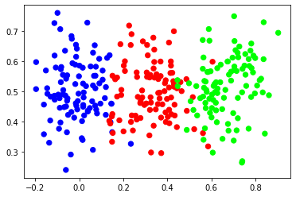
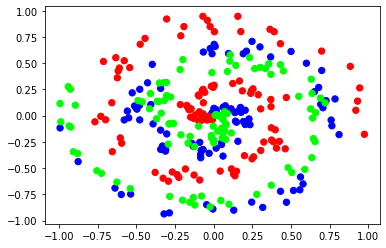

# Neural Network From Scratch

This repo contain an implementation of very simple Neural Network from scratch.

## Implemented chuncks
- Dense Layers
- Relu activation function
- Softmax activation function
- Categorical Cross Entropy
- Both forward propagation and Back propagation of each.

## Data
The data used here are generated points using numpy.

- simple Data (Vertical Data).

- Complex Data (Spiral Data).

## Credits
- [NNFS Repo](https://github.com/Sentdex/nnfs)
- [Neural Network From Scratch on Youtube](https://youtube.com/playlist?list=PLQVvvaa0QuDcjD5BAw2DxE6OF2tius3V3)
